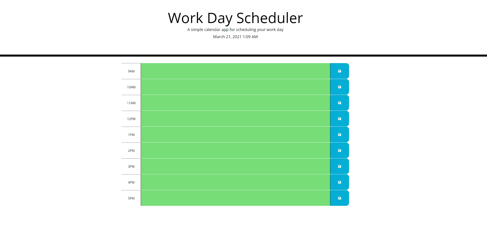
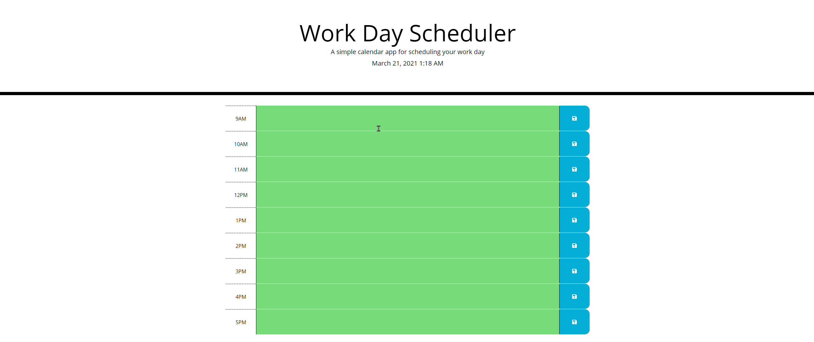

# Day-Planner

# Objective
Create a simple calendar application that allows the user to save events for each hour of the day. This app will run in the browser and feature dynamically updated HTML and CSS powered by jQuery.

# Requirements
The app should display standard business hours (9 a.m. to 5 p.m.). Each time slot should represent one hour and contain the following:
    *The time
    *A field to hold user input
    *A save button

# Functionality
Clicking on the save button will store the time and user input in localStorage.

# This application was build with:

* HTML file
* CSS file
* JS file
* Bootstrap
* JQuery
* AJAX
* Moment.js

# Mock Up 1

Day Planner Image:

Day Planner Demo:

